# 一款DotCode发布插件【Obsidian】

**obsidian** 是一款优秀的本地笔记，支持 **markdown** 格式，并且具备强大的插件系统，搭配不同的插件，能够实现强大的笔记功能。

> 官网地址：https://obsidian.md/


**obsidian-dotcode** 是基于 **obsidian** 的插件进行开发，能够将笔记直接推送到DotCode，让更多的小伙伴看到

## 使用安装教程

首先，到 release 下载对应的压缩包：`obsidian-dotcode`，然后进行解压  
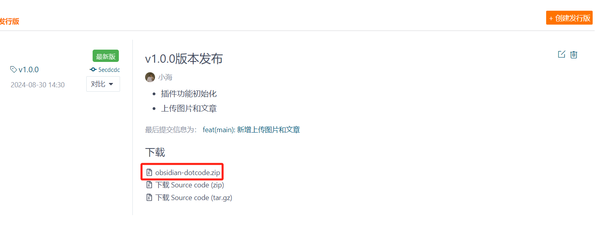

解压后，将获取到 `obsidian-dotcode` 文件夹，将其放到 `.obsidian\plugins` 目录下，目录下没有 `plugins` 文件夹，可以手动创建一个

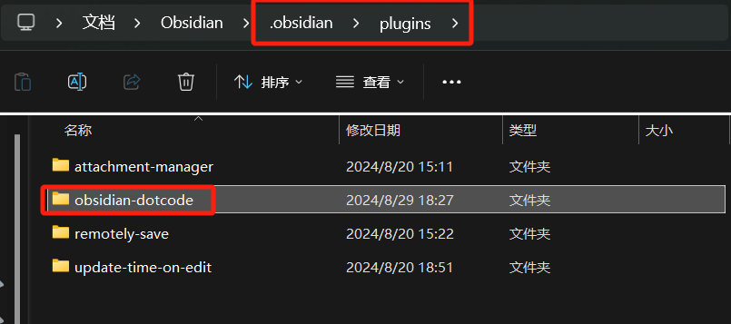

插件放到指定目录后，打开笔记系统，`点击设置-> 第三方插件`，选择关闭安全模式，这样才能使用安全模式

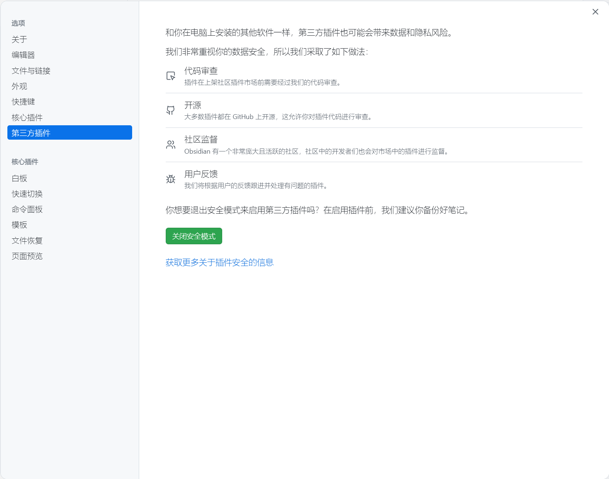

关闭后，即可看到刚刚导入的插件，将开关选择开启

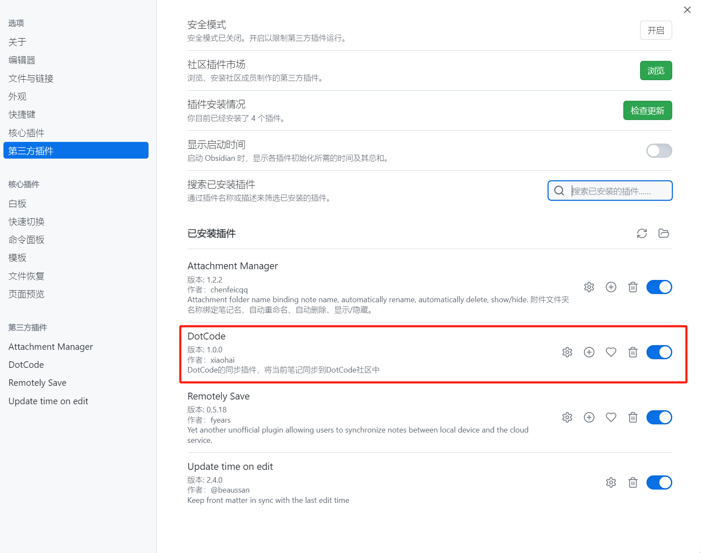

开启后，左侧可以看到 `obsidian-dotcode` 插件，这里就可以输入对应的配置了

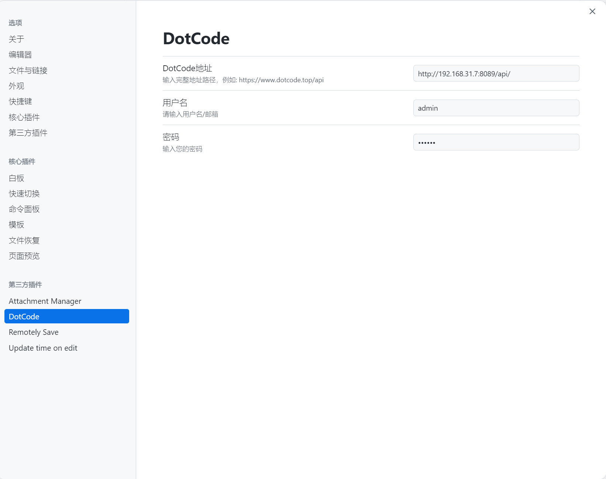

配置完成后，在笔记文件中点击发布按钮，即可使用插件

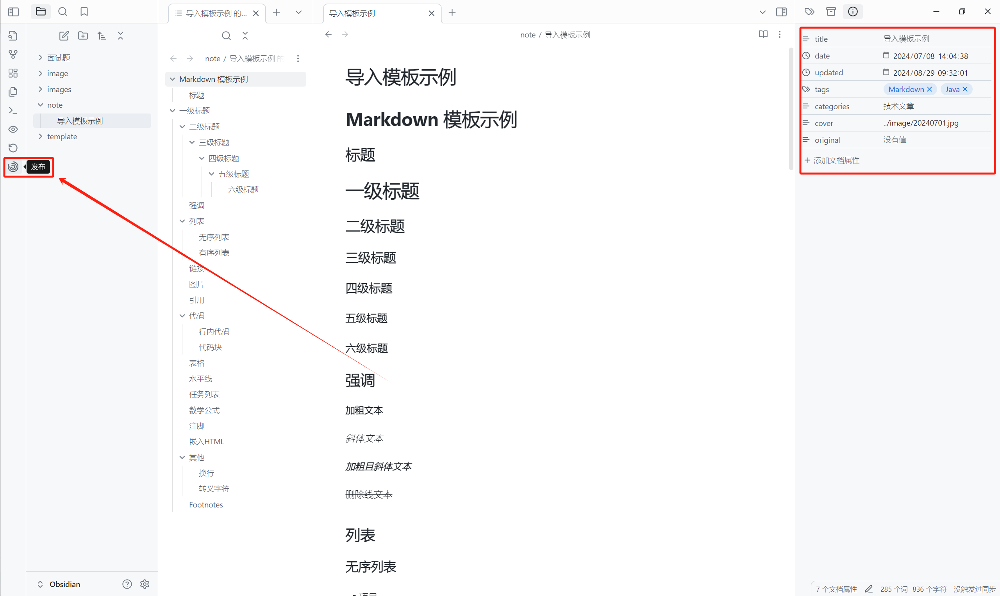

点击发布按钮，展示当前账号的信息，当前笔记信息，笔记信息为文档属性，要修改可以通过修改属性调整。  
当出现绿色提示和最近同步时间时，代表当前笔记已经存在DotCode中，可以再点击提交按钮，重新发布到DotCode
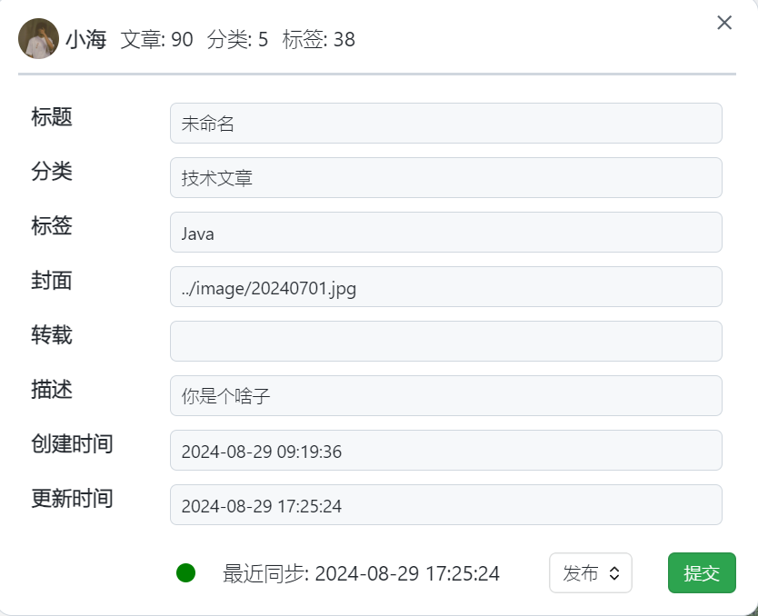

当出现灰色提示时，代表当前笔记未存在DotCode中，可以点击提交按钮，发布到DotCode 中

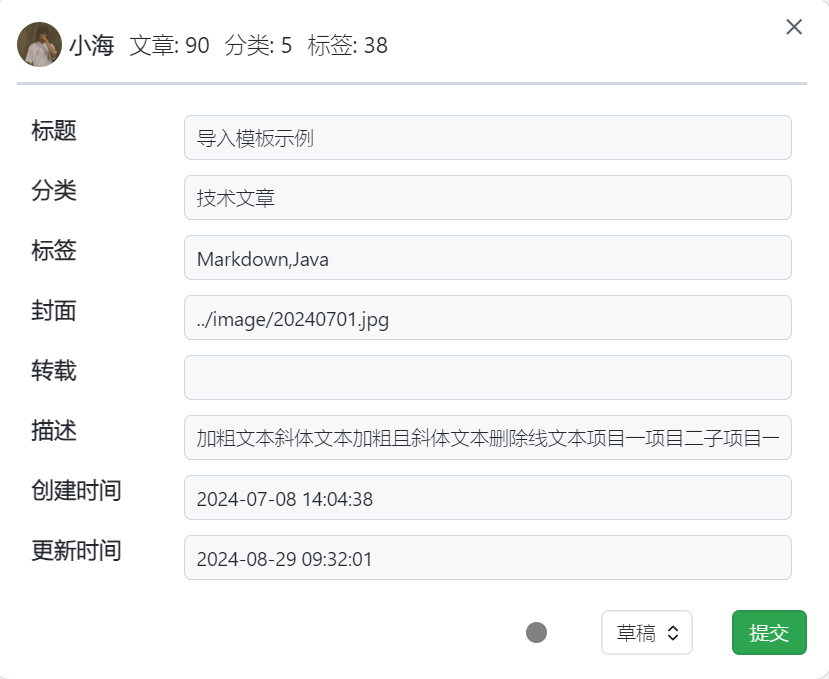

可设置快捷键，快捷键为 `ctrl + shift + k`，打开提交页面，即可发布到DotCode

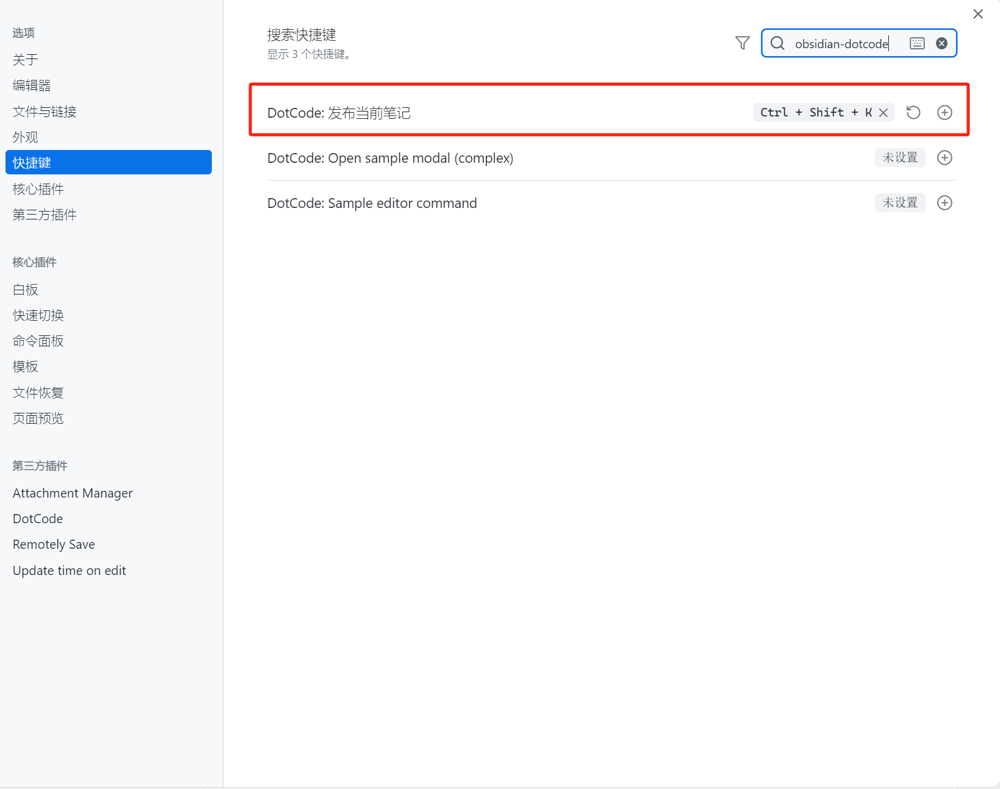

## 扩展

### 进行附件设置

为了更好的快速上传到DotCode进行如下附件设置

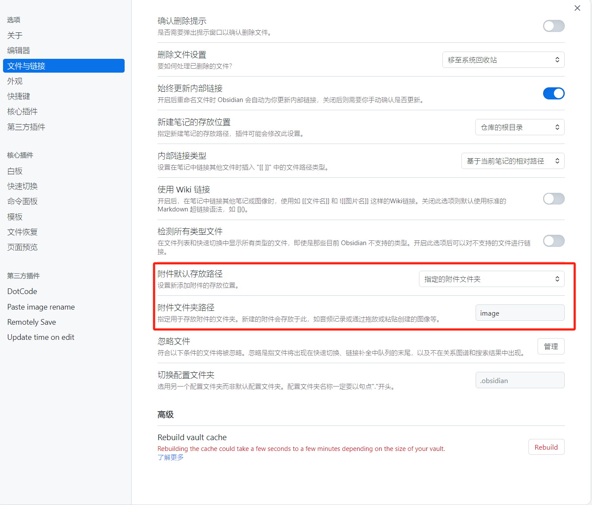

### Paste image rename

推荐安装此插件，更方便的重命名附件
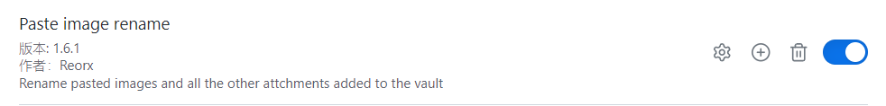
我的配置如下，目的自动重命名，按照时间命名
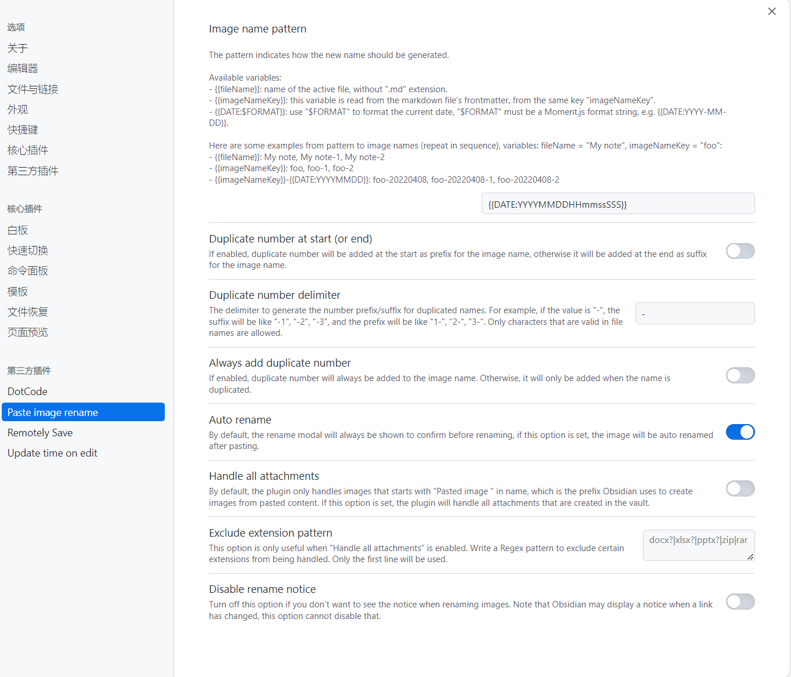

### 模板设置

在指定文件夹下创建Front Matter模板文件,内容如下
```
---
title: {{title}}
date: {{date}} {{time}}
tags:
categories: 
cover:
updated:
---
```

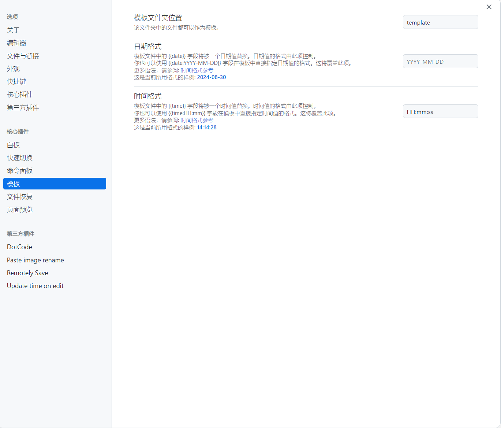


###  Update time on edit

该插件为了自动更新Front Matter中的updated时间

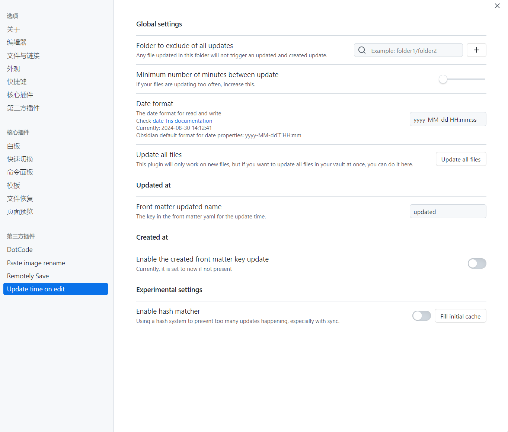
